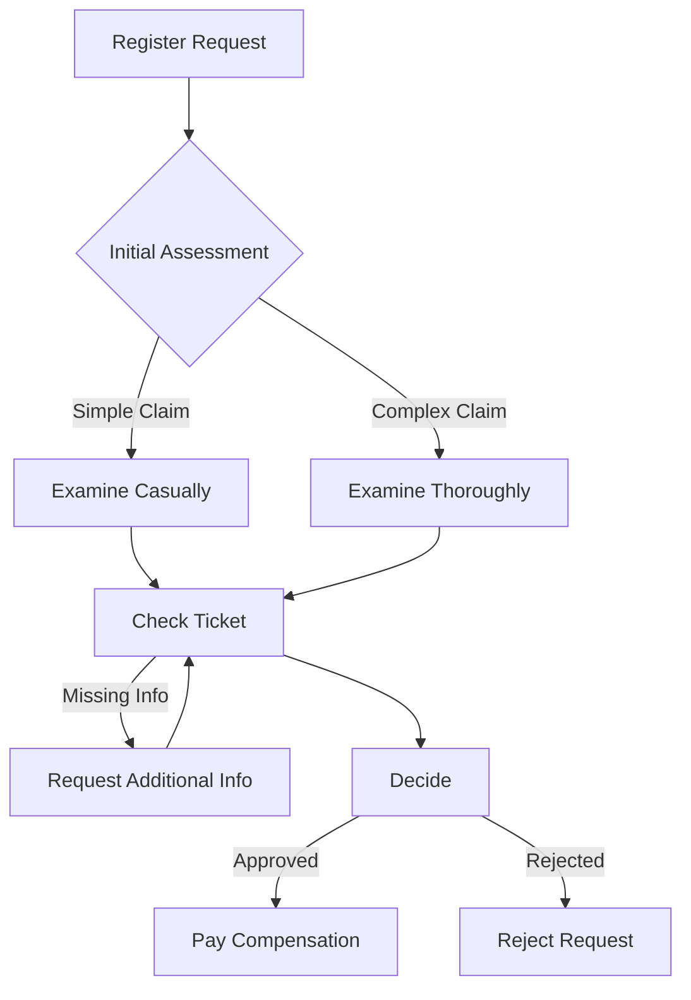

# Insurance Claims Process Documentation

## Process Overview
This documentation describes an insurance claims handling process, from initial registration to final decision and payment/rejection.

## Process Model

### Main Process Flow

### Process Attributes

#### Case Attributes
1. Request Type:
   - SIMPLE: Regular claims under standard threshold
   - COMPLEX: High-value or complicated claims
   - URGENT: Time-critical claims

2. Claim Category:
   - MEDICAL: Health insurance claims
   - PROPERTY: Property damage claims
   - LIABILITY: Third-party liability claims

3. Customer Segment:
   - PREMIUM: Premium policy holders
   - STANDARD: Standard policy holders
   - NEW: New customers (<1 year)

#### Event Attributes

1. Register Request:
   - Policy verification status
   - Initial claim value
   - Documentation completeness score

2. Examination (Casual/Thorough):
   - Risk assessment score
   - Fraud detection result
   - Documentation quality rating
   - Expert consultation needed (Y/N)

3. Check Ticket:
   - Verification level (1-3)
   - Missing document types
   - Compliance check result
   - Additional info requests count

4. Decision:
   - Decision confidence score
   - Policy coverage percentage
   - Risk level assessment
   - Authority level required

5. Payment/Rejection:
   - Final settlement amount
   - Rejection reason code
   - Appeal possibility
   - Customer notification status

### Process Variables
1. Claim Status:
   - REGISTERED
   - IN_EXAMINATION
   - PENDING_INFO
   - READY_FOR_DECISION
   - APPROVED
   - REJECTED

2. Risk Level:
   - LOW
   - MEDIUM
   - HIGH
   - CRITICAL

3. Processing Priority:
   - NORMAL
   - HIGH
   - URGENT

### Performance Metrics (KPIs)
1. Time-based:
   - Total processing time
   - Time in each status
   - Waiting time between activities
   - Resource response time

2. Quality:
   - First-time resolution rate
   - Rework percentage
   - Customer satisfaction score
   - Compliance score

3. Resource:
   - Resource utilization rate
   - Handover count
   - Specialist involvement ratio
   - Workload distribution

4. Financial:
   - Processing cost per claim
   - Settlement ratio
   - Overpayment risk score
   - Cost efficiency rating
